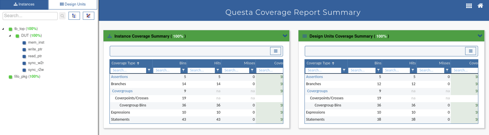
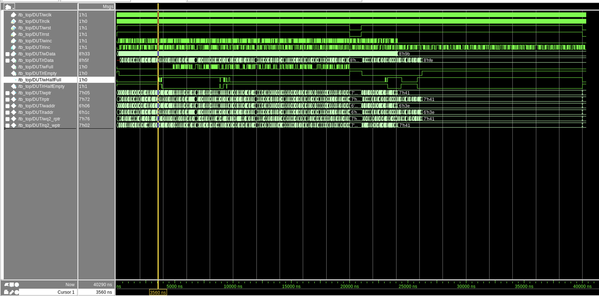

# Team3 Asynchronous FIFO Project

## Project Milestones

### Milestone 1 (M1)
- **Objective**: Initial design and conventional testbench setup.
- **Description**: In this milestone, the basic design of the asynchronous FIFO was created. A conventional testbench was set up to verify the basic functionality of the FIFO design. This testbench included simple stimulus and response checks.

### Milestone 2 (M2)
- **Objective**: Class-based testbench setup.
- **Description**: The testbench was enhanced using SystemVerilog classes. This included the creation of transaction, driver, monitor, scoreboard, and environment classes to improve the modularity and reusability of the testbench components.

### Milestone 3 (M3)
- **Objective**: Enhanced class-based testbench with additional features.
- **Description**: Additional features were added to the class-based testbench, including more complex stimulus generation and enhanced checking mechanisms.

### Milestone 4 (M4)
- **Objective**: UVM (Universal Verification Methodology) based testbench setup.
- **Description**: The testbench was further enhanced using the Universal Verification Methodology (UVM). This included the creation of UVM components such as agents, sequences, and sequencers. The UVM testbench also included coverage and assertions to ensure thorough verification of the design.

### Milestone 5 (M5)
- **Objective**: Final UVM testbench with coverage and assertions.
- **Description**: The final UVM testbench was completed with full coverage and assertions. This milestone focused on achieving high coverage and ensuring the correctness of the design through rigorous verification.

## UVM Topology
The UVM (Universal Verification Methodology) based testbench setup includes the following components:
- **Agents**: Read and Write agents for driving and monitoring the DUT.
- **Sequences**: Sequences to generate stimulus for the DUT.
- **Sequencers**: Sequencers to control the flow of sequences.
- **Monitors**: Monitors to observe the DUT's behavior.
- **Scoreboard**: Scoreboard to check the correctness of the DUT's output.
- **Environment**: Environment to encapsulate all the components.

### UVM Testbench Topology
\`\`\`
UVM_INFO @ 0: reporter [UVMTOP] UVM testbench topology:
---------------------------------------------------------------
Name                       Type                     Size  Value
---------------------------------------------------------------
uvm_test_top               fifo_random_test         -     @471 
  env                      fifo_env                 -     @478 
    ra                     read_agent               -     @493 
      rd                   read_driver              -     @618 
        rsp_port           uvm_analysis_port        -     @633 
        seq_item_port      uvm_seq_item_pull_port   -     @625 
      rm                   read_monitor             -     @641 
        port_read          uvm_analysis_port        -     @649 
      rs                   read_sequencer           -     @509 
        rsp_export         uvm_analysis_export      -     @516 
        seq_item_export    uvm_seq_item_pull_imp    -     @610 
        arbitration_queue  array                    0     -    
        lock_queue         array                    0     -    
        num_last_reqs      integral                 32    'd1  
        num_last_rsps      integral                 32    'd1  
    scb                    fifo_scoreboard          -     @500 
      read_port            uvm_analysis_imp_port_b  -     @671 
      write_port           uvm_analysis_imp_port_a  -     @663 
    wa                     write_agent              -     @486 
      wd                   write_driver             -     @789 
        rsp_port           uvm_analysis_port        -     @804 
        seq_item_port      uvm_seq_item_pull_port   -     @796 
      wm                   write_monitor            -     @812 
        port_write         uvm_analysis_port        -     @820 
      ws                   write_sequencer          -     @680 
        rsp_export         uvm_analysis_export      -     @687 
        seq_item_export    uvm_seq_item_pull_imp    -     @781 
        arbitration_queue  array                    0     -    
        lock_queue         array                    0     -    
        num_last_reqs      integral                 32    'd1  
        num_last_rsps      integral                 32    'd1  
---------------------------------------------------------------
\`\`\`

### UVM Transcript

\`\`\`
# ***** Queue Size: 10 *****
# ***** Flag Status: wFull=0, wHalfFull=0, rEmpty=0, rHalfEmpty=1 *****
# UVM_INFO async_fifo_scoreboard.sv(63) @ 440: uvm_test_top.env.scb [ASYNC_FIFO_SCOREBOARD] PASSED Expected Data: b --- DUT Read Data: b
# 	 [WRITE_MONITOR] winc = 1 	 wData = c8 	 w_count=14 	 wFull=0 	 wHalfFull=0
# 	 [READ_MONITOR] rinc = 0 	 rData = ba 	 rcount=4 	 rEmpty=0 	 rHalfEmpty=1
# ***** Queue Size: 10 *****
# ***** Flag Status: wFull=0, wHalfFull=0, rEmpty=0, rHalfEmpty=1 *****
# UVM_INFO async_fifo_scoreboard.sv(63) @ 460: uvm_test_top.env.scb [ASYNC_FIFO_SCOREBOARD] PASSED Expected Data: ba --- DUT Read Data: ba
# 	 [WRITE_MONITOR] winc = 1 	 wData = 57 	 w_count=15 	 wFull=0 	 wHalfFull=0
# 	 [READ_MONITOR] rinc = 0 	 rData = 4f 	 rcount=5 	 rEmpty=0 	 rHalfEmpty=1
# ***** Queue Size: 10 *****
# ***** Flag Status: wFull=0, wHalfFull=0, rEmpty=0, rHalfEmpty=1 *****
# UVM_INFO async_fifo_scoreboard.sv(63) @ 480: uvm_test_top.env.scb [ASYNC_FIFO_SCOREBOARD] PASSED Expected Data: 4f --- DUT Read Data: 4f
# 	 [WRITE_MONITOR] winc = 1 	 wData = b0 	 w_count=16 	 wFull=0 	 wHalfFull=0
# 	 [READ_MONITOR] rinc = 0 	 rData = f0 	 rcount=6 	 rEmpty=0 	 rHalfEmpty=1
# ***** Queue Size: 10 *****
# ***** Flag Status: wFull=0, wHalfFull=0, rEmpty=0, rHalfEmpty=1 *****
# UVM_INFO async_fifo_scoreboard.sv(63) @ 500: uvm_test_top.env.scb [ASYNC_FIFO_SCOREBOARD] PASSED Expected Data: f0 --- DUT Read Data: f0
# 	 [WRITE_MONITOR] winc = 1 	 wData = c8 	 w_count=17 	 wFull=0 	 wHalfFull=0
# 	 [READ_MONITOR] rinc = 0 	 rData = cc 	 rcount=7 	 rEmpty=0 	 rHalfEmpty=1
# ***** Queue Size: 10 *****
# ***** Flag Status: wFull=0, wHalfFull=0, rEmpty=0, rHalfEmpty=1 *****
# UVM_INFO async_fifo_scoreboard.sv(63) @ 520: uvm_test_top.env.scb [ASYNC_FIFO_SCOREBOARD] PASSED Expected Data: cc --- DUT Read Data: cc
# 	 [WRITE_MONITOR] winc = 1 	 wData = 72 	 w_count=18 	 wFull=0 	 wHalfFull=0
# 	 [WRITE_MONITOR] winc = 1 	 wData = 34 	 w_count=19 	 wFull=0 	 wHalfFull=0
# 	 [WRITE_MONITOR] winc = 1 	 wData = cb 	 w_count=20 	 wFull=0 	 wHalfFull=0
# 	 [WRITE_MONITOR] winc = 1 	 wData = ab 	 w_count=21 	 wFull=0 	 wHalfFull=0
# 	 [WRITE_MONITOR] winc = 1 	 wData = 53 	 w_count=22 	 wFull=0 	 wHalfFull=0
# 	 [READ_MONITOR] rinc = 0 	 rData = 81 	 rcount=8 	 rEmpty=0 	 rHalfEmpty=1
\`\`\`

## UVM Report Summary

\`\`\`
# --- UVM Report Summary ---
# 
# ** Report counts by severity
# UVM_INFO :  884
# UVM_WARNING :    0
# UVM_ERROR :    0
# UVM_FATAL :    0
# ** Report counts by id
# [ASYNC_FIFO_SCOREBOARD]   250
# [Questa UVM]     2
# [READ_AGENT_CLASS]     1
# [READ_DRIVER_CLASS]     4
# [READ_MONITOR]   343
# [READ_MONITOR_CLASS]     1
# [READ_SEQUENCER_CLASS]     3
# [READ_SEQUENCE_CLASS]     2
# [RNTST]     1
# [SCOREBOARD]     1
# [TEST_DONE]     1
# [UVMTOP]     1
# [WRITE_AGENT_CLASS]     1
# [WRITE_DRIVER_CLASS]     4
# [WRITE_MONITOR]   262
# [WRITE_MONITOR_CLASS]     1
# [WRITE_SEQUENCER_CLASS]     3
# [WRITE_SEQUENCE_CLASS]     2
# [tb_top]     1
\`\`\`

## Coverage Report Summary

### Coverage Report Summary Data by Instance

\`\`\`
=================================================================================
=== Instance: /tb_top/DUT/mem_inst
=== Design Unit: work.fifo_memory
=================================================================================
    Enabled Coverage              Bins      Hits    Misses  Coverage
    ----------------              ----      ----    ------  --------
    Branches                         6         6         0   100.00%
    Expressions                      2         2         0   100.00%
    Statements                      11        11         0   100.00%

=================================================================================
=== Instance: /tb_top/DUT/write_ptr
=== Design Unit: work.write_pointer
=================================================================================
    Enabled Coverage              Bins      Hits    Misses  Coverage
    ----------------              ----      ----    ------  --------
    Branches                         2         2         0   100.00%
    Expressions                      3         3         0   100.00%
    Statements                      11        11         0   100.00%

=================================================================================
=== Instance: /tb_top/DUT/read_ptr
=== Design Unit: work.read_pointer
=================================================================================
    Enabled Coverage              Bins      Hits    Misses  Coverage
    ----------------              ----      ----    ------  --------
    Branches                         2         2         0   100.00%
    Expressions                      1         1         0   100.00%
    Statements                      11        11         0   100.00%

=================================================================================
=== Instance: /tb_top/DUT/sync_w2r
=== Design Unit: work.sync
=================================================================================
    Enabled Coverage              Bins      Hits    Misses  Coverage
    ----------------              ----      ----    ------  --------
    Branches                         2         2         0   100.00%
    Statements                       5         5         0   100.00%

=================================================================================
=== Instance: /tb_top/DUT/sync_r2w
=== Design Unit: work.sync
=================================================================================
    Enabled Coverage              Bins      Hits    Misses  Coverage
    ----------------              ----      ----    ------  --------
    Branches                         2         2         0   100.00%
    Statements                       5         5         0   100.00%

=================================================================================
=== Instance: /tb_top/DUT
=== Design Unit: work.asynchronous_fifo
=================================================================================
    Enabled Coverage              Bins      Hits    Misses  Coverage
    ----------------              ----      ----    ------  --------
    Expressions                      4         4         0   100.00%

=================================================================================
=== Instance: /tb_top
=== Design Unit: work.tb_top
=================================================================================
    Enabled Coverage              Bins      Hits    Misses  Coverage
    ----------------              ----      ----    ------  --------
    Covergroups                      9        na        na   100.00%
        Coverpoints/Crosses         19        na        na        na
            Covergroup Bins         36        36         0   100.00%

=================================================================================
=== Instance: /fifo_pkg
=== Design Unit: work.fifo_pkg
=================================================================================
    Enabled Coverage              Bins      Hits    Misses  Coverage
    ----------------              ----      ----    ------  --------
    Assertions                       5         5         0   100.00%

TOTAL COVERGROUP COVERAGE: 100.00%  COVERGROUP TYPES: 9

TOTAL ASSERTION COVERAGE: 100.00%  ASSERTIONS: 5

Total Coverage By Instance (filtered view): 100.00%
\`\`\`

## Post M5 Snapshot
Below are the key highlights from the transcript in the Post_M5 folder:

- **Compilation of Modules:**
  - asynchronous_fifo
  - fifo_memory
  - sync
  - read_pointer
  - write_pointer
  - fifo_pkg
  - tb_top
  - async_fifo_test_sv_unit
  - async_fifo_driver_sv_unit
  - async_fifo_env_sv_unit
  - async_fifo_testrand_sv_unit
  - async_fifo_interface_sv_unit
  - async_fifo_read_agent_sv_unit
  - async_fifo_write_agent_sv_unit
  - async_fifo_read_monitor_sv_unit
  - async_fifo_write_monitor_sv_unit
  - async_fifo_scoreboard_sv_unit
  - async_fifo_sequencer_sv_unit
  - async_fifo_seq_item_sv_unit
  - async_fifo_seq_test_sv_unit
  - async_fifo_coverage_sv_unit

- **Start and End Times:**
  - Start time: 01:40:38 on Jun 08,2024
  - End time: 01:40:55 on Jun 08,2024

- **Errors and Warnings Summary:**
  - Errors: 0
  - Warnings: 0

## Coverage Report and Waveform
Below are the coverage report and waveform images from the Post_M5 folder:

### Coverage Report

### Waveform

## Explanation of run.do File

The \`run.do\` file is a script used to automate the compilation, simulation, and coverage analysis of the asynchronous FIFO design. Below is an explanation of each command in the \`run.do\` file:

1. **vdel -all**
   - Deletes all existing libraries and their contents.

2. **vlib work**
   - Creates a new library named \`work\`.

3. **vlog -source -lint async_fifo.sv**
   - Compiles the \`async_fifo.sv\` file with source code and linting enabled.
   - The commented lines with \`+define\` are used to compile the design with specific bug definitions for testing purposes.

4. **vlog -source -lint async_fifo_package.sv**
   - Compiles the \`async_fifo_package.sv\` file with source code and linting enabled.

5. **vlog -source -lint +define+RESET_SEQUENCE async_fifo_top.sv**
   - Compiles the \`async_fifo_top.sv\` file with the \`RESET_SEQUENCE\` definition enabled.

6. **vlog -source -lint async_fifo_test.sv**
   - Compiles the `async_fifo_test.sv` file with source code and linting enabled.

7. **vlog -source -lint async_fifo_driver.sv**
   - Compiles the `async_fifo_driver.sv` file with source code and linting enabled.

8. **vlog -source -lint async_fifo_env.sv**
   - Compiles the `async_fifo_env.sv` file with source code and linting enabled.

9. **vlog -source -lint async_fifo_interface.sv**
   - Compiles the `async_fifo_interface.sv` file with source code and linting enabled.

10. **vsim -coverage async_fifo_top -voptargs="+cover=bcesfx"**
    - Simulates the `async_fifo_top` module with coverage options enabled.

11. **run -all**
    - Runs the simulation until all events are processed.

12. **coverage report -code bcesft**
    - Generates a coverage report for branch, condition, expression, state, and toggle coverage.

13. **coverage report -assert -binrhs -details -cvg**
    - Generates a detailed coverage report for assertions.

14. **vcover report -html coverage_results**
    - Generates an HTML report of the coverage results.

15. **coverage report -codeAll**
    - Generates a comprehensive coverage report for all code coverage metrics.