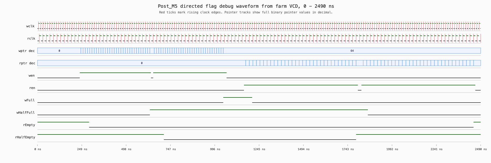
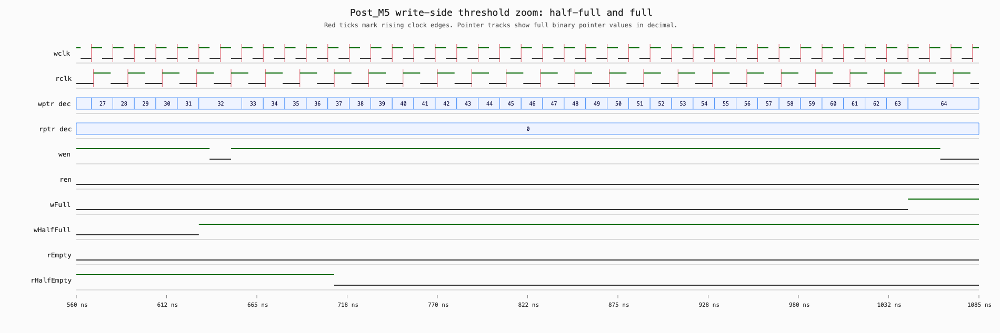
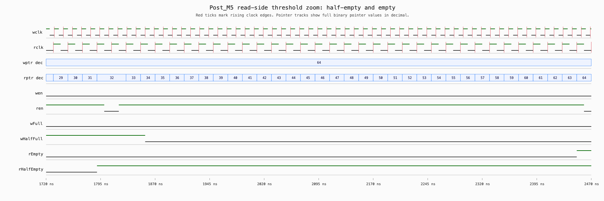
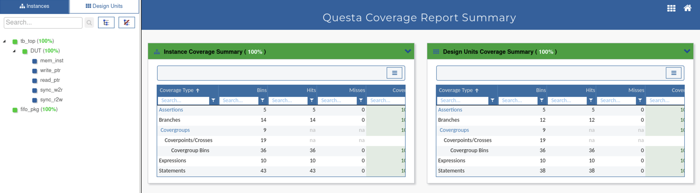

# Team 3 Asynchronous FIFO Verification Project

This repository is a complete SystemVerilog/UVM verification project for an
asynchronous FIFO: a hardware buffer that safely moves data between two unrelated
clock domains.  The project is organized as a milestone-by-milestone evolution
from a conventional procedural testbench to a final UVM environment with
scoreboarding, coverage, bug injection, reset-aware checking, and farm-backed
waveform evidence.

The short version:

- **Design problem:** safely transfer data from an 80 MHz write domain to a
  50 MHz read domain without losing ordering, corrupting data, or falsely
  asserting status flags.
- **Final implementation:** `Post_M5/UVM/` is the canonical final design and
  verification environment.
- **Verification result:** the final farm run is warning-clean, reaches
  `UVM_ERROR : 0`, `UVM_FATAL : 0`, reports **100% DUT-focused code coverage**
  and **100% covergroup coverage**, and proves exact half/full/empty flag
  timing with directed waveform tests.
- **What this showcases:** CDC-aware RTL design, Gray-coded pointer logic,
  UVM architecture, race-free driver/monitor timing, reset-aware scoreboarding,
  functional coverage, defect injection, and reproducible simulator evidence.

## The Recruiter Walkthrough

If I were walking someone through this repo live, I would frame it this way:

1. **This is not just an RTL FIFO.** It is a verification progression that shows
   how a simple testbench matures into a production-style UVM environment.
2. **The hard part is the clock-domain crossing.** The FIFO has independent
   write and read clocks, so the design cannot share a normal counter across
   domains.  It uses binary pointers locally, Gray-coded pointers across clock
   boundaries, and two-flop synchronizers in the destination domain.
3. **The verification environment had to be engineered carefully.** The drivers
   drive before the active clock edge, monitors publish only accepted transfers,
   and the scoreboard models the FIFO with a queue instead of trusting internal
   DUT state.
4. **The repo includes negative testing hooks.** The final RTL has intentional
   bug-injection macros for data corruption, synchronizer damage, pointer
   encoding errors, and broken full-flag logic.
5. **The evidence is real.** The transcripts and waveform images were generated
   from Siemens Questa runs on the PSU ECE farm, not from hand-written examples.

## Final Result At A Glance

The final implementation lives in [`Post_M5/UVM/`](Post_M5/UVM/).  It is the
best place to start when reviewing the project.

| Area | Result |
|---|---|
| Simulator | Siemens Questa 2021.3_1 |
| Final target | [`Post_M5/UVM`](Post_M5/UVM/) |
| FIFO depth | 64 entries |
| Data width | 8 bits |
| Write clock | 12.5 ns period, 80 MHz |
| Read clock | 20 ns period, 50 MHz |
| CDC strategy | Gray pointers + two-flop destination-domain synchronizers |
| Scoreboard | Reset-aware queue reference model |
| Coverage | 100% DUT-filtered code coverage + 100% covergroup coverage |
| Directed flags | Immediate half-full, full, half-empty, and empty threshold checks |
| Farm proof | [`Post_M5/UVM/MANIFEST.txt`](Post_M5/UVM/MANIFEST.txt) |



The waveform above is a directed flag-debug run.  The red ticks mark rising
clock edges, the pointer tracks show decimal pointer positions, and the lower
signals show write/read enables plus all four key flags.  This is the kind of
artifact I use to explain that the status flags are not merely asserted
eventually; they assert at the intended threshold edges.

## What An Asynchronous FIFO Does

An asynchronous FIFO is used when producer and consumer logic run on different
clocks.  In this project, the write side can push data every 12.5 ns while the
read side can pull data every 20 ns.  Since those domains are independent, the
design must avoid two common mistakes:

- **Unsafe CDC state sharing:** a normal `fifo_count` written by both clocks is
  not safe or portable.
- **Multi-bit metastability hazards:** sending a raw binary pointer across a
  clock boundary can expose the destination domain to multiple changing bits.

The final design solves this with a standard, robust CDC pattern:

```text
Write domain                                  Read domain
------------                                  -----------
binary_wptr                                   binary_rptr
    |                                             |
    v                                             v
Gray-coded wptr  ---> 2-FF sync into rclk ---> rq2_wptr
wFull / wHalfFull                         rEmpty / rHalfEmpty

Read domain                                   Write domain
-----------                                   ------------
Gray-coded rptr  ---> 2-FF sync into wclk ---> wq2_rptr
```

## Final RTL Architecture

The canonical DUT is [`Post_M5/UVM/async_fifo.sv`](Post_M5/UVM/async_fifo.sv).
It is intentionally split into small modules with one clear responsibility each:

```text
asynchronous_fifo
|-- fifo_memory      storage array, write/read gating
|-- write_pointer    binary/Gray write pointer, wFull, wHalfFull
|-- read_pointer     binary/Gray read pointer, rEmpty, rHalfEmpty
|-- sync_w2r         write pointer synchronized into the read clock domain
`-- sync_r2w         read pointer synchronized into the write clock domain
```

### Key Design Decisions

**1. Binary locally, Gray across domains**

Inside each domain, pointer arithmetic is easiest and safest in binary.  When a
pointer crosses into the other clock domain, it is Gray encoded so only one bit
changes per increment.  That limits the CDC sampling risk to one changing bit
instead of an arbitrary binary transition.

**2. One extra pointer bit for wrap awareness**

The FIFO address is 6 bits for 64 entries, but the pointer is 7 bits.  The extra
MSB lets the design distinguish:

- same address, same wrap: FIFO is empty;
- same address, different wrap: FIFO is full.

This is why full detection is not a naive pointer equality check.

**3. Synchronizers live in the destination domain**

The two-flop synchronizers are clocked and reset by the domain that consumes the
synchronized pointer.  That is a subtle CDC detail and one of the important
fixes carried through the milestone progression.

```systemverilog
sync_w2r (.clk(rclk), .rst_n(rrst), ...);  // write pointer into read domain
sync_r2w (.clk(wclk), .rst_n(wrst), ...);  // read pointer into write domain
```

**4. Half flags are computed from next-pointer occupancy**

The final design does not use a shared dual-clock `fifo_count`.  Instead:

```systemverilog
assign wptr_diff = binary_wptr_next - binary_rptr_sync;
assign rptr_diff = binary_wptr_sync - binary_rptr_next;
```

That is deliberate.  Using the **next** local pointer means `wHalfFull` asserts
on the same accepted write that reaches 32 entries, and `rHalfEmpty` asserts on
the same accepted read that drops occupancy to 32 entries.  Earlier versions
exposed a one-clock-late half-flag bug; the directed tests now prove the fix.

### Flag Threshold Evidence

Write-side threshold zoom:



Read-side threshold zoom:



These two images are useful in an interview because they turn a subtle CDC flag
timing discussion into something visual:

- at write pointer 32, `wHalfFull` is asserted;
- at write pointer 64, `wFull` is asserted;
- at read pointer 32 while write pointer is 64, `rHalfEmpty` is asserted;
- at read pointer 64, `rEmpty` is asserted.

## UVM Verification Architecture

The final UVM environment is built around separate write and read agents.  Each
domain has its own sequencer, driver, and monitor.  The scoreboard joins both
streams through analysis ports and checks ordering with a queue.

```text
tb_top
|-- DUT: asynchronous_fifo
|-- intf: shared SystemVerilog interface
`-- uvm_test_top: fifo_random_test / fifo_base_test
    `-- fifo_env
        |-- write_agent
        |   |-- write_sequencer
        |   |-- write_driver
        |   `-- write_monitor
        |-- read_agent
        |   |-- read_sequencer
        |   |-- read_driver
        |   `-- read_monitor
        `-- fifo_scoreboard
```

### Why The Testbench Timing Matters

This is one of the most important verification lessons in the repo.  The DUT
samples on rising clock edges.  If a driver also changes signals on the same
rising edge, the testbench can race the DUT.  The final environment drives
stimulus on the negative edge, so data and enables are stable before the DUT
samples them.

The monitors also avoid false observations.  They sample request and pre-edge
flag state, then publish only accepted transfers:

- write accepted if `winc && !wFull`;
- read accepted if `rinc && !rEmpty`.

That means the scoreboard models actual FIFO transactions, not just attempted
transactions.

### Reset-Aware Scoreboard

The final [`fifo_scoreboard`](Post_M5/UVM/async_fifo_scoreboard.sv) uses a
SystemVerilog queue as a reference model:

- accepted writes push expected `wData`;
- accepted reads pop and compare against DUT `rData`;
- unknown data, empty-queue reads, and mismatches raise `uvm_error`;
- reset assertions flush pending expected data so the scoreboard stays aligned
  with the DUT during the default reset-sequence run.

Final farm scoreboard summary from
[`Post_M5/UVM/transcript_farm.txt`](Post_M5/UVM/transcript_farm.txt):

```text
Writes observed       : 659
Reads  observed       : 596
Reset flushes         : 2
Residual expected_q   : 0
Mismatches / errors   : 0
Verdict: *** PASSED ***
UVM_WARNING : 0
UVM_ERROR   : 0
UVM_FATAL   : 0
```

## Coverage Strategy

The final run intentionally instruments the DUT rather than inflating numbers by
measuring testbench internals.  The run script uses DUT-scoped coverage:

```tcl
vopt tb_top -o top_optimized +acc +cover=sbfec+asynchronous_fifo(rtl).
```

The coverage model includes:

- statement, branch, expression, and condition coverage on the DUT;
- covergroups for flag states and transitions;
- data integrity and data pattern coverage;
- burst, idle, high-frequency, abrupt-change, reset, and throughput behavior.



The final farm evidence reports:

```text
DUT filtered instance coverage: 100.00%
TOTAL COVERGROUP COVERAGE:     100.00%
Covergroup types:              9
```

## Techniques Worth Highlighting

These are the parts I would explicitly call out because they show practical
verification judgment:

**Independent reference model**

The scoreboard does not peek into the DUT's internal memory or pointer state.
It builds its own expected queue from accepted writes and compares only against
accepted reads.  That separation is important because a scoreboard that reuses
the DUT's internal assumptions can miss the same bug the DUT has.

**Accepted-transfer modeling**

The monitors distinguish attempted operations from accepted operations.  A write
request while full is useful stimulus, but it should not push the scoreboard
queue.  A read request while empty is also useful stimulus, but it should not pop
expected data.  Modeling this correctly is what lets the verification
environment test overflow and underflow pressure without creating false errors.

**Defect-driven verification**

Several fixes in the repo were made only after a directed test or real farm run
exposed a weakness.  Examples include the half-flag one-clock-late issue and the
standalone `fifo2` over-full RAM overwrite.  The pattern is deliberate:

```text
observe failure -> isolate root cause -> patch RTL/TB -> rerun farm sim ->
commit transcript + waveform proof
```

**Readable waveform generation**

Instead of committing raw VCDs, the repo keeps scripts that parse VCDs into CSV,
SVG, and PNG artifacts.  That makes debug evidence easy to review in GitHub and
easy to discuss in an interview without launching Questa's waveform viewer.

**DUT-focused coverage**

Coverage is scoped to the design under test.  This avoids the common mistake of
reporting high coverage because the testbench itself was instrumented.

## Intentional Bug Injection

The final RTL includes guarded bug macros that can be enabled one at a time in
`run.do`.  They are intentionally commented out in the default passing build.

| Macro | What it breaks | Why it is valuable |
|---|---|---|
| `WDATA_CORRUPTION_BUG` | Corrupts write data before storing | Proves the scoreboard catches data integrity failures |
| `SYNC_BUG` | Removes the second synchronizer flop | Exercises CDC robustness checks |
| `RPTR_BUG` | Uses binary read pointer instead of Gray | Tests pointer encoding assumptions |
| `WPTR_FULLFLAG_BUG` | Uses naive full equality | Proves wrap-aware full detection matters |

This is a strong verification technique because it checks that the testbench
fails for real bugs, not just that it passes for the happy path.

## Milestone Progression

The repo is intentionally organized as snapshots.  Each milestone can be read as
a step in verification maturity.

| Directory | What it demonstrates |
|---|---|
| [`M1/ConventionalTB`](M1/ConventionalTB/) | Procedural SystemVerilog testbench, queue scoreboard, first farm artifacts |
| [`M2/CLASS`](M2/CLASS/) | Pre-UVM class-based architecture: generator, driver, monitor, scoreboard, environment |
| [`M3/CLASS`](M3/CLASS/) | Enhanced class TB with coverage and directed half-flag timing evidence |
| [`M4/UVM`](M4/UVM/) | UVM conversion: agents, sequencers, sequences, monitors, scoreboard |
| [`M5/UVM`](M5/UVM/) | UVM coverage, assertions, bug-injection hooks, improved run flow |
| [`Post_M5/UVM`](Post_M5/UVM/) | Canonical final implementation with reset-aware scoreboard and final farm proof |
| [`Miscellaneous`](Miscellaneous/) | Standalone FIFO variants, additional directed flag/debug experiments |

The history matters because it shows more than a finished answer.  It shows the
engineering path: identify a weakness, create evidence, fix the design or
testbench, and preserve the proof.

## Notable Engineering Fixes

These are the design and verification issues that are worth calling out during a
technical walkthrough:

**CDC synchronizer domain correction**

Several earlier snapshots had synchronizers clocked or reset in the wrong
domain.  The fixed pattern puts both synchronizer flops in the destination
domain.

**Elimination of unsafe dual-clock occupancy**

A shared `fifo_count` is tempting, but it is not a safe CDC structure if both
clocks write it.  The final design computes occupancy locally from local binary
pointers and synchronized remote Gray pointers.

**Immediate half-flag timing**

The half flags originally behaved one clock late in some versions.  Directed
tests now prove the immediate threshold behavior.

**Race-free testbench sampling**

Drivers moved to negedge drive timing; monitors publish only accepted
transactions.  This prevents the testbench from creating false pass/fail
behavior due to simulator scheduling races.

**Reset-aware checking**

The final Post_M5 run keeps periodic reset stimulus enabled and makes the
scoreboard robust to it.  That is harder than simply disabling reset to make the
test pass.

**Reproducible debug artifacts**

The repo includes scripts that parse farm-generated VCDs into CSV, SVG, and PNG
waveforms.  This turns simulator evidence into artifacts that can be reviewed
without opening a waveform GUI.

## How To Run The Final Simulation

This project targets Siemens/Mentor Questa.  The checked-in farm transcripts
were generated with Questa 2021.3_1.

From the final directory:

```sh
cd Post_M5/UVM
vsim -c -do "do run.do; quit -f"
```

Focused directed flag run:

```sh
cd Post_M5/UVM
vsim -c -do "do run_flags.do; quit -f"
```

Regenerate waveform images after a VCD-producing run:

```sh
cd Post_M5/UVM
python3 make_artifacts.py
python3 make_flag_debug_waveforms.py
```

The `quit -f` is important for noninteractive runs because the run scripts set
`NoQuitOnFinish 1`.

## Where To Look First

For a fast review:

1. [`Post_M5/UVM/async_fifo.sv`](Post_M5/UVM/async_fifo.sv)
   Final RTL: memory, pointer handlers, Gray conversion, synchronizers, flags.

2. [`Post_M5/UVM/async_fifo_scoreboard.sv`](Post_M5/UVM/async_fifo_scoreboard.sv)
   Reset-aware queue scoreboard and final PASS/FAIL summary.

3. [`Post_M5/UVM/async_fifo_coverage.sv`](Post_M5/UVM/async_fifo_coverage.sv)
   Functional coverage model.

4. [`Post_M5/UVM/run.do`](Post_M5/UVM/run.do)
   Questa compile, optimization, simulation, and coverage flow.

5. [`Post_M5/UVM/MANIFEST.txt`](Post_M5/UVM/MANIFEST.txt)
   The concise farm evidence record: what was run, what passed, and what
   artifacts were generated.

6. [`Post_M5/UVM/design.md`](Post_M5/UVM/design.md)
   Detailed post-fix engineering notes.

## Suggested Interview Story

Here is a concise way to present the project:

> This repo verifies an asynchronous FIFO used for clock-domain crossing.  I
> started from procedural and class-based testbenches, then evolved the
> environment into UVM with independent read/write agents, a queue scoreboard,
> coverage, assertions, and bug-injection hooks.  The final design uses
> Gray-coded pointers and destination-domain two-flop synchronizers.  A key bug
> I fixed was half-full and half-empty flags asserting one clock late; the fix
> computes flags from next-pointer occupancy, and the repo includes farm-backed
> waveforms proving the exact threshold behavior.  The final Questa run is
> warning-clean, reset-aware, reports zero UVM errors/fatals, and hits 100%
> coverage.

## Repository Notes

- The milestone directories are historical snapshots.  They are useful for
  showing progression, but [`Post_M5/UVM`](Post_M5/UVM/) is the canonical final
  implementation.
- Raw simulator outputs such as `.vcd`, `.ucdb`, `.wlf`, `work/`, and
  `modelsim.ini` are gitignored.  The repo commits the useful derived evidence:
  transcripts, manifests, CSV samples, SVGs, and PNGs.
- [`CLAUDE.md`](CLAUDE.md) documents the project-specific simulation workflow
  and farm conventions used while repairing and verifying the repo.
